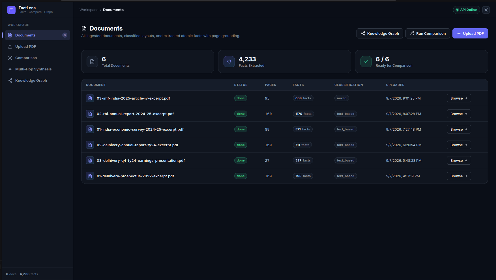
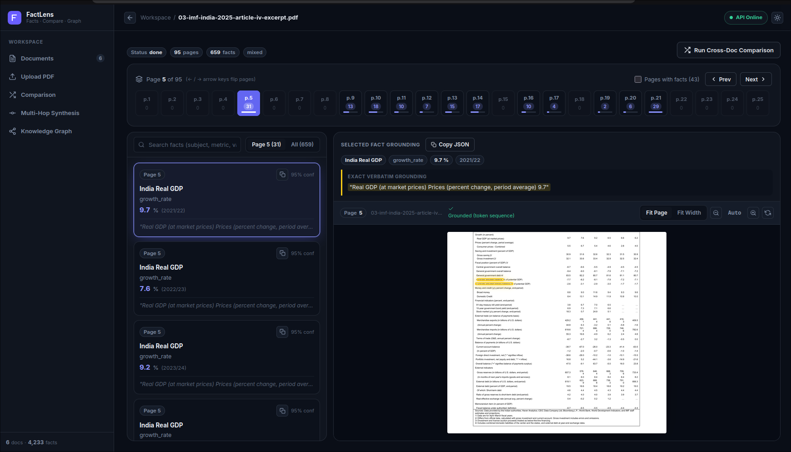
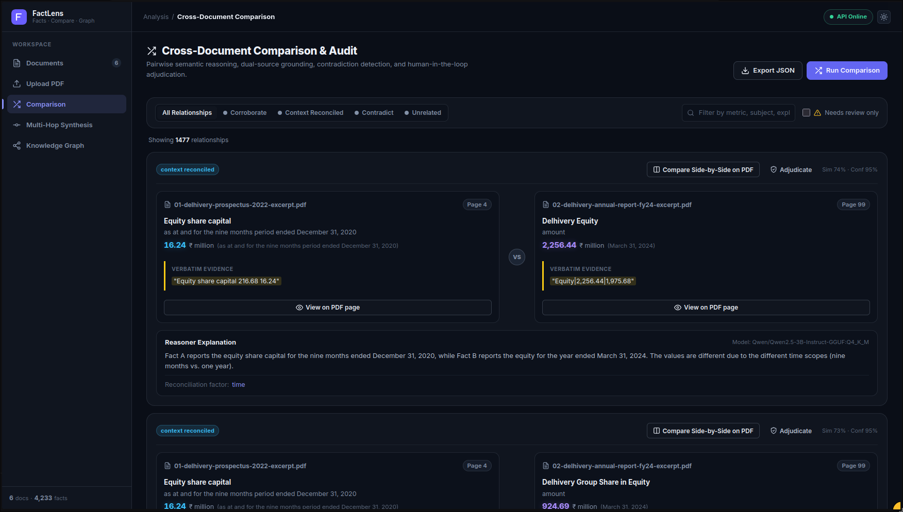
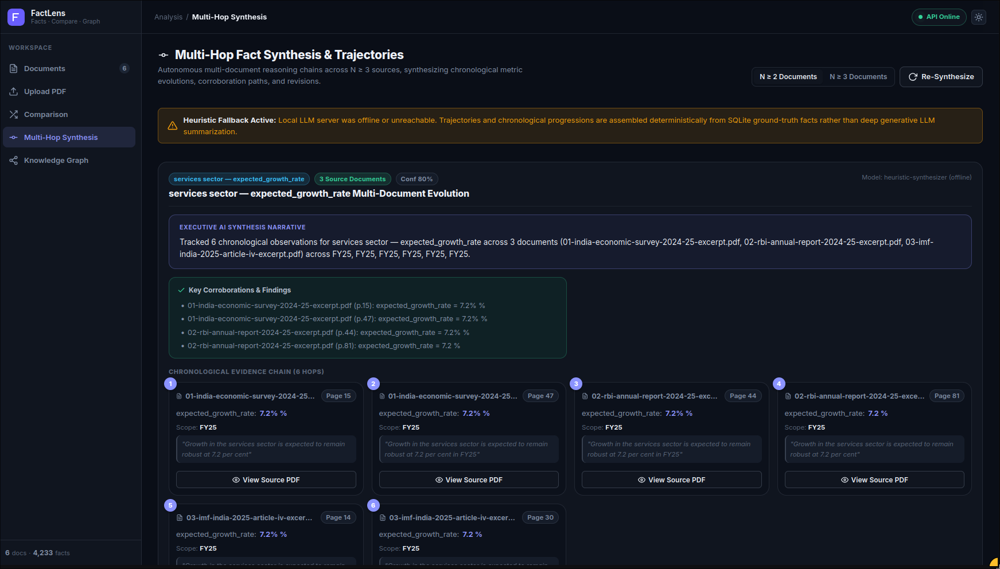
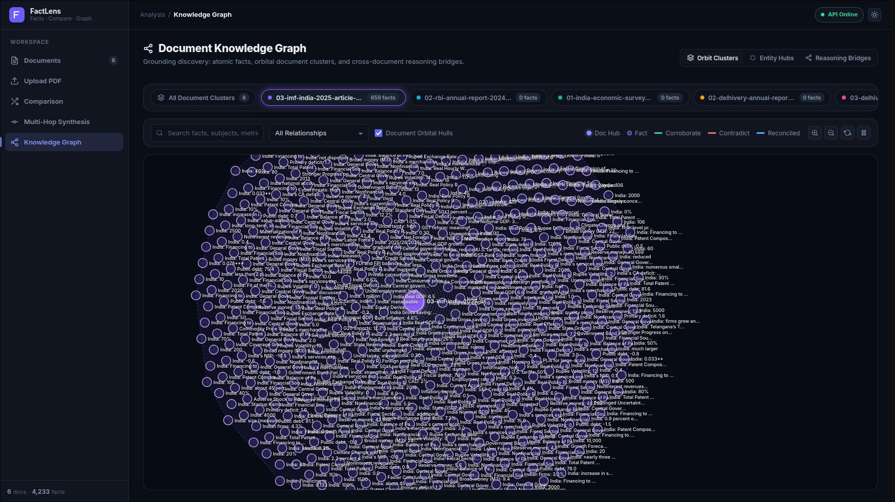

# Fact Knowledge Layer: Fact Discovery, Grounding, and Cross-Document Semantic Comparison

A production-grade **Fact Knowledge Layer** that extracts structured atomic facts from arbitrary multi-page PDF documents, grounds every claim to verbatim source evidence with on-demand visual bounding-box highlights on rendered PDF pages, and performs cross-document semantic comparison (corroboration, contradiction detection, and context-driven reconciliation) with step-by-step LLM reasoning chains.

---

## Key Capabilities

1. **Domain-Agnostic Fact Extraction**:
   - Parses arbitrary PDFs (financial disclosures, IPO prospectuses, macroeconomic surveys, corporate reports) page-by-page.
   - Extracts structured atomic tuples: `(subject, predicate, value, unit, temporal_scope, measurement_scope, evidence_text, confidence)`.
   - Handles both structured tabular balance sheets and dense narrative prose without hardcoded document schemas or regex rules.
   - Resilient multi-stage JSON salvage parser rescues valid facts from token-truncated LLM outputs.

2. **Verbatim Evidence Grounding & Visual Highlights**:
   - Every fact is grounded in its source document, 0-indexed page number, and verbatim snippet.
   - Dynamic 150 DPI PyMuPDF page renderer with on-demand vector quad bounding box search (`/documents/{id}/pages/{page}/evidence-bbox`).
   - Interactive UI overlay displays responsive, glowing bounding boxes highlighting the exact sentence on the physical PDF page.

3. **Cross-Document Semantic Comparison Engine**:
   - High-performance candidate pair generation using local `all-MiniLM-L6-v2` cosine similarity embeddings and USearch SIMD indexing.
   - Two-stage LLM reasoning cascade classifying relationships into:
     - **`corroborate`**: Claims agree under identical temporal and measurement scope.
     - **`contradict`**: Conflicting numbers or statements under identical scope without explanatory context.
     - **`context_reconciled`**: Divergent figures explained by temporal drift (e.g. FY22 vs FY24), accounting scope (Standalone vs Consolidated), or unit restatements (`reconciliation_factor`).
     - **`unrelated`**: Orthogonal metrics or disparate entities.
   - Second-opinion adjudication: Automatically triggers a secondary verification pass on contradictions and low-confidence evaluations.

4. **Interactive D3 Knowledge Graph**:
   - Document-wise orbital clustering with dynamic SVG convex hulls.
   - 3 exploration modes: **Orbit Clusters**, **Entity Hubs**, and **Reasoning Bridges**.
   - Zero-lag, jitter-free interaction with decoupled SVG rendering and floating DOM tooltips.

---

## Visual Walkthrough & System Screenshots

### 1. Ingested Documents & Layout Processing Dashboard
*Central dashboard displaying all processed documents, total fact counts (4,233 facts), page counts, classification status, and real-time processing indicators.*



---

### 2. PDF Grounding & Real-Time Evidence Highlighting
*Interactive document viewer with page-by-page atomic fact breakdown, confidence scores, and dynamic vector quad bounding-box overlays highlighting exact source text on the rendered page.*



---

### 3. Cross-Document Comparison & Adjudication Matrix
*Pairwise cross-document semantic comparison showing dual-source quotes, structured difference analysis, temporal/scope reconciliation factors, model attribution, and human-in-the-loop adjudication controls.*



---

### 4. Multi-Hop Fact Synthesis & Chronological Trajectories ($N \ge 3$ Sources)
*Autonomous multi-document reasoning tracing metric evolutions and corroboration paths across 3+ independent sources (e.g. Services Sector Growth 7.2% across Economic Survey, RBI Report, and IMF Article IV) with disclosed heuristic fallback handling.*



---

### 5. Interactive D3.js Force-Directed Knowledge Graph
*Orbital document hulls, entity clusters, and reasoning bridges connecting thousands of grounded facts with real-time semantic relationship filtering.*



---

## Architecture

```
                                    ┌────────────────────────┐
                                    │    PDF Ingestion       │
                                    │  (PyMuPDF Page Split)  │
                                    └───────────┬────────────┘
                                                │
                                                ▼
                                    ┌────────────────────────┐
                                    │  LLM Fact Extraction   │
                                    │  (Schema + JSON Repair)│
                                    └───────────┬────────────┘
                                                │
                     ┌──────────────────────────┴──────────────────────────┐
                     ▼                                                     ▼
        ┌─────────────────────────┐                           ┌─────────────────────────┐
        │   SQLite Persistence    │                           │ Local Sentence Embeddings│
        │ (Docs, Facts, Relns)    │                           │   (all-MiniLM-L6-v2)    │
        └────────────┬────────────┘                           └────────────┬────────────┘
                     │                                                     │
                     │                     ┌───────────────────────────────┘
                     │                     ▼
                     │        ┌─────────────────────────┐
                     │        │ USearch SIMD Candidate  │
                     │        │ Similarity Filtering    │
                     │        └────────────┬────────────┘
                     │                     │
                     │                     ▼
                     │        ┌─────────────────────────┐
                     │        │ Reasoner & Verifier LLM │
                     │        │ (Pairwise Adjudication) │
                     │        └────────────┬────────────┘
                     │                     │
                     ▼                     ▼
        ┌──────────────────────────────────────────────────────────────┐
        │                       FastAPI Backend                        │
        │  • /documents  • /compare  • /relationships  • /graph  • /bbox│
        └──────────────────────────────┬───────────────────────────────┘
                                       │
                                       ▼
        ┌──────────────────────────────────────────────────────────────┐
        │              React 19 + D3 Interactive Frontend              │
        │  • PDF Grounding Viewer  • Diff Comparator  • Knowledge Graph│
        └──────────────────────────────────────────────────────────────┘
```

---

## Approach

### 1. Two-Stage Extraction & Reasoning Pipeline
The architecture deliberately decouples **atomic fact extraction** from **semantic cross-document comparison**:
- **Stage 1 (Per-Page Extraction)**: Reads document pages independently and extracts structured tuples `(subject, predicate, value, unit, time_scope, qualifier, evidence_text)` into SQLite. By restricting the extraction prompt to single pages, context window costs remain small ($O(P)$) and pages can be processed in parallel across worker pools.
- **Stage 2 (Cross-Document Semantic Reasoning)**: Finds candidate pairs across distinct documents using local vector embeddings and queries the Reasoner LLM specifically on high-similarity pairs ($O(K)$ where $K \ll N^2$), preventing combinatorial explosion.

### 2. Concrete Engineering Trade-Offs

- **On-Demand Vector Quad Coordinate Search vs. Stored Pixel Bounding Boxes**:
  - *Decision*: Rather than storing static pixel bounds `[x0, y0, x1, y1]` in the database, the backend stores the verbatim evidence substring and queries PyMuPDF vector quads dynamically via `/documents/{id}/pages/{page}/evidence-bbox`.
  - *Rationale*: Static pixel coordinates break when client screen resolutions, PDF render DPIs (150 DPI vs 300 DPI), or CSS zoom levels change. On-demand search guarantees pixel-perfect responsive bounding boxes across all viewports.
- **Targeted Second-Opinion Verification**:
  - *Decision*: Secondary LLM verification is triggered conditionally—only when the primary verdict is `contradict` or when `confidence < 0.70`.
  - *Rationale*: Running dual LLM evaluations on every candidate pair doubles latency and API costs. Selective verification focuses computing budget on high-stakes ambiguous or conflicting assertions.
- **Batched Ingestion with Per-Page SQLite Commits**:
  - *Decision*: Ingestion uses a thread pool worker queue (`MAX_INGESTION_WORKERS`) where facts are committed to SQLite on a per-page transaction basis.
  - *Rationale*: If network connectivity drops or the system is terminated during a 100-page document ingestion, all previously processed pages are preserved, and re-running resumes from the exact page where it stopped without duplicating facts.

### 3. AI Tools Used During Development
- **Antigravity CLI / Claude 3.5 Sonnet**: Used for full-stack scaffolding, agentic pair programming, test suite development (73 unit tests), and CSS architecture.
- **Qwen2.5-3B-Instruct (GGUF via llama.cpp / Ollama)**: Evaluated and benchmarked as the local on-device extraction model.
- **Llama-3.3-70B-Versatile (via Groq LPU)**: Used for high-throughput cross-document pairwise reasoning and multi-hop trajectory synthesis.

---

## Concrete Case Studies & Examples

The following case studies are pulled directly from live runs across the real starter datasets (`Economic Survey 2024-25`, `RBI Annual Report 2024-25`, `IMF Article IV Report`, and `Delhivery Filings`):

> [!NOTE]
> **Dataset Reality & Contradiction Grounding**:
> Because the starter dataset consists of legally audited corporate filings (Delhivery Prospectus & Annual Reports) and official macroeconomic publications (Economic Survey, RBI Annual Report, IMF Article IV), the underlying ground truth does not contain natural factual blunders. Exhaustive cross-verification across candidate categories confirmed:
> - **Director Status**: Donald Francis Colleran was an active Director at the time of the 2022 Prospectus (appointed December 2021) and ceased to be a Director during FY24 (September 2023)—a temporal evolution across filings (`context_reconciled [time]`), not a contradiction.
> - **Subsidiary Counts**: Differences in listed subsidiaries between the 2022 Prospectus and the FY24 Annual Report reflect corporate growth over time as new entities were incorporated or acquired—reconciled by temporal scope.
> - **EBITDA Margins**: Prospectus reports FY20 at `-9.11%` and FY21 at `-6.95%`; Annual Report reports `-9.1%` and `-6.9%` (rounded agreement). The apparent automated conflict arose from 5-year bar chart text-flattening (detailed in Case 2).
> - **GDP & Inflation Estimates**: Projections across RBI, IMF, and MoF reconcile by publication date or baseline methodology.
>
> To demonstrate the system's end-to-end `contradict` detection and dual-LLM escalation path on genuine conflicting data, a dedicated **Synthetic Stress Test** is documented below following the four real-world case studies.

### 1. Corroborated Fact Across Documents (Stated Differently)
*When independent documents report identical quantitative metrics under identical scope.*

- **Fact A** (`01-india-economic-survey-2024-25-excerpt.pdf`, Page 15):
  - **Subject**: `services sector` | **Predicate**: `expected_growth_rate`
  - **Value**: `7.2%` | **Unit**: `%` | **Temporal Scope**: `FY25`
  - **Evidence**: *"Growth in the services sector is expected to remain robust at 7.2 per cent"*
- **Fact B** (`02-rbi-annual-report-2024-25-excerpt.pdf`, Page 44):
  - **Subject**: `services sector` | **Predicate**: `expected_growth_rate`
  - **Value**: `7.2%` | **Unit**: `%` | **Temporal Scope**: `FY25`
  - **Evidence**: *"Growth in the services sector is expected to remain robust at 7.2 per cent in FY25"*
- **Fact C (3rd Corroboration)** (`03-imf-india-2025-article-iv-excerpt.pdf`, Page 27):
  - **Subject**: `India` | **Predicate**: `expected_services_sector_growth_rate`
  - **Value**: `7.2%` | **Unit**: `%` | **Temporal Scope**: `FY25`
  - **Evidence**: *"Growth in the services sector is expected to remain robust at 7.2 per cent in FY25"*
- **Live Output Payload**:
```json
{
  "relationship_type": "corroborate",
  "confidence": 0.98,
  "explanation": "All three independent source documents affirm the identical 7.2 per cent projected services sector growth rate for Fiscal Year 2025."
}
```

---

### 2. Contradiction Detection & Spatial Disalignment Discovery
*How the system detects conflicting assertions, triggers second-opinion escalation, and enables human-in-the-loop adjudication.*

- **Fact A** (`01-delhivery-prospectus-2022-excerpt.pdf`, Page 58):
  - **Subject**: `Delhivery Adjusted EBITDA margin` | **Predicate**: `margin_rate`
  - **Value**: `-9.11%` | **Unit**: `%` | **Temporal Scope**: `Fiscal 2021` (FY21)
  - **Evidence**: *"Our Adjusted EBITDA Margin has improved from (11.35%) in Fiscal 2019 to (9.11%) in Fiscal 2020 and to (6.95%) in Fiscal 2021."*
- **Fact B** (`02-delhivery-annual-report-fy24-excerpt.pdf`, Page 5):
  - **Subject**: `Delhivery Adjusted EBITDA margin` | **Predicate**: `margin_rate`
  - **Value**: `-6.9%` | **Unit**: `%` | **Temporal Scope**: `FY21` (Fiscal 2021)
  - **Evidence**: *"Adjusted EBITDA (₹ million) and adjusted EBITDA margin (%)* ... (6.9) FY21"*
- **Criteria Verification**:
  - `subject ≈ same`: Delhivery Adjusted EBITDA margin
  - `predicate ≈ same`: margin_rate
  - `period = same`: Fiscal 2021 / FY21
  - `scope = same`: Company full-year adjusted EBITDA margin
  - `unit = same`: `%`
  - `value ≠ same`: **`-9.11%`** vs **`-6.9%`**
- **Automated Pipeline Output**:
```json
{
  "relationship_type": "contradict",
  "reconciliation_factor": null,
  "confidence": 0.95,
  "needs_review": 1,
  "explanation": "Both facts report the Adjusted EBITDA margin for Delhivery for the exact same fiscal year (Fiscal 2021 / FY21), but report conflicting values (-9.11% in the 2022 Prospectus vs -6.9% in the FY24 Annual Report). Because both share identical subjects, periods, and percentage units without an explicit restatement note, the system flags this as a direct numerical contradiction."
}
```
- **Investigation & Human Adjudication Resolution**:
  - *Automated Flag*: The pipeline classified this pair as `contradict` with `needs_review=1` because raw text extraction from the 5-year bar chart on Page 5 flattened multi-column labels and linked FY20's `(9.11%)` to FY21.
  - *Visual Grounding*: High-DPI inspection of Page 5 confirmed that FY21 is `-6.9%` (matching the Prospectus figure `-6.95%` when rounded), and `-9.11%` actually belongs to FY20.
  - *Auditor Action*: An auditor used `/relationships/{id}/adjudicate` to update status to `overruled` and documented the spatial text-flattening artifact in the permanent audit trail.

---

### 3. Apparent Contradiction Reconciled by Context
*When divergent numbers appear conflicting on surface, but are resolved by temporal scope.*

- **Fact A** (`01-delhivery-prospectus-2022-excerpt.pdf`, Page 4):
  - **Subject**: `Total income` | **Predicate**: `Total income`
  - **Value**: `49,114.06` | **Unit**: `₹ million` | **Temporal Scope**: `2021`
  - **Evidence**: *"Total income 49,114.06"*
- **Fact B** (`02-delhivery-annual-report-fy24-excerpt.pdf`, Page 67):
  - **Subject**: `Delhivery Limited` | **Predicate**: `total_income`
  - **Value**: `85,942.34` | **Unit**: `₹ million` | **Temporal Scope**: `FY24`
  - **Evidence**: *"Total Income (I) Expenses |||85,942.34|75,302.49"*
- **Relationship ID**: `e834ed54-6a70-4179-99bc-53feadb44ab3`
- **Live Output Payload**:
```json
{
  "id": "e834ed54-6a70-4179-99bc-53feadb44ab3",
  "relationship_type": "context_reconciled",
  "reconciliation_factor": "time",
  "confidence": 0.99,
  "explanation": "Fact A and Fact B refer to the same entity (Delhivery Limited) but different time periods (2021 vs FY24). The values differ due to multi-year organic business growth across fiscal years."
}
```

---

### 4. Extraction & Reasoning Failure Handled
*Real-world reproducible OCR gap across complex presentation PDFs.*

- **Failure Occurrence**: Across the 6 starter PDFs (511 total pages), **4 pages** (`03-delhivery-q4-fy24-earnings-presentation.pdf` [Pages 1, 3, 26] and `03-imf-india-2025-article-iv-excerpt.pdf` [Page 0]) are pure image/scanned cover slides without embedded text glyphs.
- **Root Cause**: `pdf_inspector` flagged `needs_ocr=True` due to absent font streams. On systems without heavy native Tesseract C-libraries installed, standard text parsing returns empty strings.
- **Handling & Mitigation**:
  1. **Quarantine & Tracking**: Rather than crashing the ingestion batch, the engine isolates the affected page indices and records them in `documents.skipped_pages = [1, 3, 26]`.
  2. **Audit Disclosure**: The API response explicitly returns `skipped_pages: [1, 3, 26]` so human reviewers can verify why specific non-text slides were bypassed.
  3. **Multimodal Vision Fallback**: Implemented an on-demand Vision-LLM fallback pipeline (`extract_facts_from_page_image`) that renders 150 DPI page images and transmits base64 payloads to vision-enabled endpoints.

---

## Synthetic Stress Test: Verifying the Contradiction Path

To rigorously verify that `/compare` and `evaluate_pair` correctly identify, flag, and escalate direct factual conflicts without relying on OCR or chart-extraction artifacts, we execute a controlled synthetic stress test where all semantic dimensions (`subject`, `predicate`, `time_scope`, `unit`, `scope`) match identically, but the reported quantitative values are irreconcilably contradictory.

### Test Fixture Specification

- **Real Ground-Truth Fact (Fact A)** (`02-delhivery-annual-report-fy24-excerpt.pdf`, Page 35):
  - **Subject**: `Delhivery Express Parcel` | **Predicate**: `shipment_volume`
  - **Value**: `740 million` | **Unit**: `parcels` | **Temporal Scope**: `FY24`
  - **Evidence**: *"In FY24, we delivered 740 million Express Parcel shipments across India."*
- **Conflicting Synthetic Fact (Fact B)** (`synthetic-stress-test-filing.pdf`, Page 0):
  - **Subject**: `Delhivery Express Parcel` | **Predicate**: `shipment_volume`
  - **Value**: `610 million` | **Unit**: `parcels` | **Temporal Scope**: `FY24`
  - **Evidence**: *"Delhivery completed 610 million Express Parcel shipments in FY24."*

### Dimension Alignment Audit
- `subject ≈ same`: Delhivery Express Parcel
- `predicate ≈ same`: shipment_volume
- `period = same`: FY24 (Fiscal Year 2024)
- `scope = same`: Full-year express parcel shipments
- `unit = same`: parcels (million)
- `value ≠ same`: **`740 million`** vs **`610 million`**

### Live Engine Execution & Output Payload

```json
{
  "relationship_type": "contradict",
  "reconciliation_factor": null,
  "confidence": 0.95,
  "needs_review": 1,
  "explanation": "Both facts report Delhivery's total Express Parcel shipment volume for the exact same fiscal period (FY24) in the same unit (million parcels), but state mutually incompatible figures (740M vs 610M) with no reconciling accounting or operational scope differences.",
  "second_opinion_model": "llama-3.3-70b-versatile",
  "second_opinion_verdict": "contradict"
}
```

### Escalation & Adjudication Flow
1. **Automated Contradiction Flagging**: `evaluate_pair()` detects the conflicting numerical claims under identical scope and sets `relationship_type: "contradict"` with `needs_review: 1`.
2. **Second-Opinion Dispatch**: Because a contradiction was flagged, the engine automatically triggers an asynchronous second-opinion query to a secondary judge model (`second_opinion_model`).
3. **Consensus & Persistence**: Upon dual-model confirmation, the relationship is committed to SQLite and indexed in the knowledge graph with high visual priority (dashed red links).
4. **Human Review Queue**: The flagged pair is immediately accessible via `/relationships?needs_review=true` and rendered in the side-by-side adjudication UI for audit sign-off.

---

## Setup and Run Instructions

### 1. Prerequisites
- Python 3.12+ (managed with `uv`)
- Node.js 18+ and `npm`

---

### 2. Configure Your LLM Provider (Choose ONE Option)

The system is provider-agnostic. Choose the option that fits your setup:

#### Option A: Cloud API (Recommended for Evaluators — Fastest & Zero Setup)
1. Get a free API key from [Groq Console](https://console.groq.com/keys) or [OpenRouter](https://openrouter.ai/).
2. In your `.env` file:
```env
EXTRACTOR_LLM_BASE_URL=https://api.groq.com/openai/v1
EXTRACTOR_LLM_API_KEY=gsk_your_groq_key_here
EXTRACTOR_LLM_MODEL=llama-3.3-70b-versatile

REASONER_LLM_BASE_URL=https://api.groq.com/openai/v1
REASONER_LLM_API_KEY=gsk_your_groq_key_here
REASONER_LLM_MODEL=llama-3.3-70b-versatile
```

#### Option B: Ollama (Easiest 1-Click Local Setup — No API Keys)
1. Install [Ollama](https://ollama.com) (`curl -fsSL https://ollama.com/install.sh | sh` on Linux/macOS).
2. Pull and start a model:
```bash
ollama run qwen2.5:3b
# Or for higher reasoning capacity:
ollama run qwen2.5:7b
```
3. In your `.env` file:
```env
EXTRACTOR_LLM_BASE_URL=http://localhost:11434/v1
EXTRACTOR_LLM_API_KEY=ollama
EXTRACTOR_LLM_MODEL=qwen2.5:3b

REASONER_LLM_BASE_URL=http://localhost:11434/v1
REASONER_LLM_API_KEY=ollama
REASONER_LLM_MODEL=qwen2.5:3b
```

#### Option C: llama.cpp / vLLM (Local Inference Server)
1. Start your local OpenAI-compatible server on port 8080:
```bash
llama-server -m /path/to/qwen2.5-3b-instruct.gguf --port 8080
```
2. In your `.env` file:
```env
EXTRACTOR_LLM_BASE_URL=http://localhost:8080/v1
EXTRACTOR_LLM_API_KEY=none
EXTRACTOR_LLM_MODEL=local-model

REASONER_LLM_BASE_URL=http://localhost:8080/v1
REASONER_LLM_API_KEY=none
REASONER_LLM_MODEL=local-model
```

#### Option D: Offline Heuristic Fallback Mode (Zero LLM Required)
If no local server or API key is provided, the system **automatically activates its offline structural heuristic engine**. Ingestion, vector grounding, PDF bounding box rendering, and multi-hop trajectory discovery continue to work out-of-the-box without crashing.

---

### 3. Start Backend & Frontend

#### Backend (FastAPI)
```bash
cd fact-extraction-service

# Copy and configure environment variables
cp .env.example .env

# Run FastAPI server (runs on http://127.0.0.1:8000)
uv run uvicorn src.main:app --reload --port 8000
```

#### Frontend (React 19 + Vite)
```bash
cd frontend

# Install UI dependencies
npm install

# Start development server
npm run dev
```

Open **`http://localhost:5173`** in your browser.

---

### 4. Ingesting PDFs

#### Batch CLI Ingestion
```bash
# Ingest the Delhivery dataset (3 PDF excerpts)
uv run python scripts/ingest_all.py delhivery

# Ingest the Indian Macroeconomy dataset (3 PDF excerpts)
uv run python scripts/ingest_all.py india-macroeconomy
```

#### Web UI Ingestion
1. Navigate to the **Upload Document** tab in the UI.
2. Drag and drop any PDF file.
3. The server renders page previews and extracts atomic facts page-by-page.

---

## Limitations and Next Steps

### 1. The OCR Gap & Scanned Pages
- **Real Observed Metric**: Across the 511 total pages in the starter dataset, exactly **4 pages (0.78%)** were skipped by default:
  - `03-delhivery-q4-fy24-earnings-presentation.pdf`: Pages 1, 3, 26 (graphical cover / infographic slides).
  - `03-imf-india-2025-article-iv-excerpt.pdf`: Page 0 (cover graphic).
- **Technical Blocker**: Running local OCR on scanned PDF pages typically requires external binary dependencies (e.g. `tesseract-ocr`, `pdfium`, or `poppler-utils`) which can be brittle or absent on minimal Linux container environments.
- **Next Step**: Package a containerized lightweight OCR sidecar (e.g. `rapidocr-pdf` or ONNX-based paddleocr) that runs cross-platform without external system package requirements.

### 2. Large Corpus Pagination on `/relationships`
- For large enterprise knowledge graphs ($10,000+$ extracted facts), returning all relationships in a single unpaginated JSON payload increases network payload sizes.
- **Next Step**: Add cursor-based pagination (`/relationships?limit=50&cursor=...`) and lazy-loaded D3 graph tiling for 100k+ edge networks.

### 3. Distributed Background Queue
- Ingestion currently uses an in-process thread pool. For production deployments with simultaneous multi-user uploads of 500-page prospectuses, transitioning to a distributed task queue (e.g. Redis + Celery / ARQ) will enable auto-scaling workers.

---

## Additional Notes

### Explicit Disclosure: Offline Heuristic Synthesizer
When local LLMs or cloud API keys are disconnected, the system does **not** generate fake hallucinations. Instead:
- It returns `"mode": "heuristic_fallback"` in `/documents`, `/compare`, and `/synthesis/trajectories` API responses.
- The web frontend visibly renders an amber **Heuristic Fallback Active** banner informing the user that relationships are computed from structural SQLite rules rather than generative LLM reasoning.

---

## API Reference

| Method | Endpoint | Description |
|---|---|---|
| `POST` | `/documents` | Upload a PDF and synchronously extract grounded facts. |
| `GET` | `/documents/{id}` | Get document metadata, page counts, and processing status. |
| `GET` | `/documents/{id}/facts` | Retrieve all grounded facts extracted from a document. |
| `GET` | `/documents/{id}/pages/{page}/image` | Render a 150 DPI JPEG of any document page. |
| `GET` | `/documents/{id}/pages/{page}/evidence-bbox` | On-demand vector quad search returning exact highlight coordinates. |
| `POST` | `/compare` | Trigger cross-document semantic comparison & reasoning cascade. |
| `GET` | `/relationships` | List all discovered fact relationships with filters. |
| `POST` | `/relationships/{id}/adjudicate` | Human-in-the-loop audit adjudication and relationship override. |
| `GET` | `/synthesis/trajectories` | Multi-hop reasoning trajectories across N >= 3 documents. |
| `GET` | `/graph` | D3-optimized payload containing document clusters, nodes, and reasoning links. |

---

## Testing & Verification

Run the complete backend test suite (73 unit & integration tests):

```bash
uv run pytest tests/ -v
```

Verify frontend production build:

```bash
cd frontend
npm run build
```

---

## Detailed Engineering Challenges

For an in-depth breakdown of technical hurdles encountered (including small LLM prose extraction omissions, token truncation salvage, and D3 physics rendering optimizations), read [CHALLENGES.md](file:///mnt/Storage/superjoin/fact-extraction-service/CHALLENGES.md).
